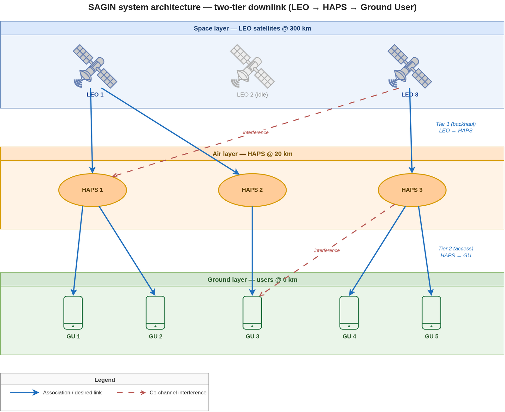
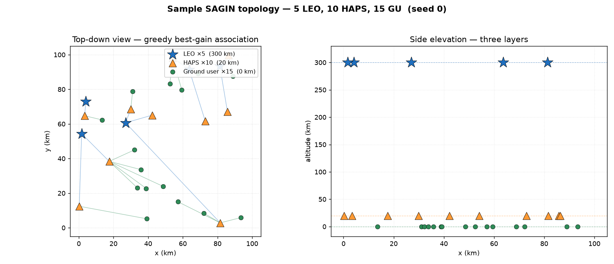
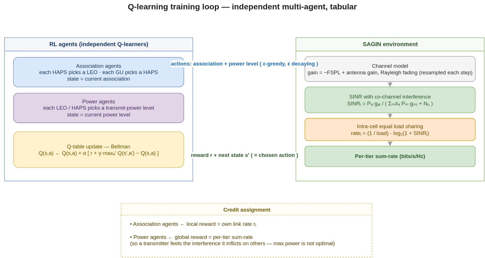
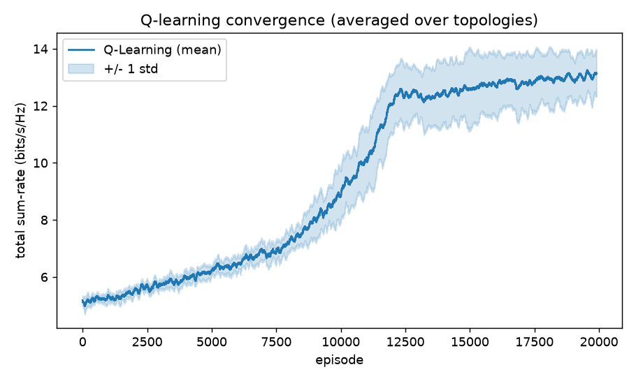
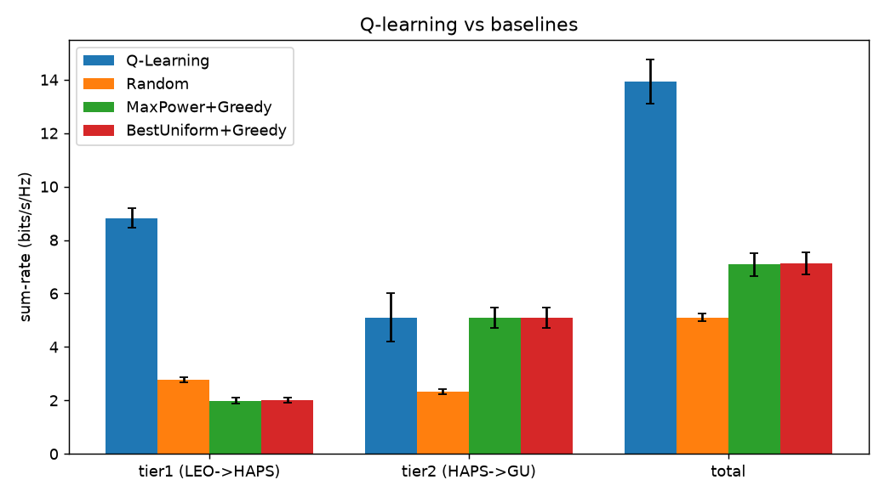

# SAGIN Association & Power Optimization with Q-Learning (clean rewrite)

Tabular **Q-learning** that jointly optimizes **user association** and **transmit
power** in a **Space–Air–Ground Integrated Network (SAGIN)** to maximize system
sum-rate.

This is a clean, reproducible, baseline-backed rewrite of an old MATLAB project
([original repo history](https://github.com/Lewis-panda/Optimizing-SAGIN-Association-Link-Power-Using-Reinforcement-Learning)).
The original `.m` files are preserved under [`legacy-matlab/`](legacy-matlab/).

> ### ⚠️ Scope / honesty note (read first)
> This problem — RL for joint association + power in satellite–HAPS–ground
> networks — has **extensive prior work**, so this project makes **no claim of
> research novelty**. It is positioned as a *correct engineering reference
> implementation* (portfolio / teaching / a baseline for other papers).
> Representative prior work:
> - Alsharoa & Alouini, *Joint User Association and Beamforming in Integrated Satellite-HAPS-Ground Networks*, IEEE TWC — [arXiv:2204.13257](https://arxiv.org/abs/2204.13257)
> - *Deep Q-Learning-Based Transmission Power Control of a HAPS with Spectrum Sharing*, MDPI Sensors 2022 — [link](https://www.mdpi.com/1424-8220/22/4/1630)
> - *Machine Learning-Based User Scheduling in Integrated Satellite-HAPS-Ground Networks* — [arXiv:2205.13958](https://arxiv.org/abs/2205.13958)
> - Survey: *On the Interplay of AI and SAGIN* — [arXiv:2402.00881](https://arxiv.org/abs/2402.00881)

---

## Problem

Two independent downlink tiers (each on its own band):

```
tier 1 (backhaul):  LEO  ──►  HAPS
tier 2 (access):    HAPS ──►  Ground User
```

Each receiver associates with exactly one transmitter; each transmitter picks one
power level from a discrete codebook. The objective is to maximize the combined
sum-rate `tier1 + tier2` (bits/s/Hz).



## System model

| Component | Model |
|-----------|-------|
| Geometry | 100×100 km service area; LEO @ 300 km, HAPS @ 20 km, GU @ 0 km, random placement |
| Path loss | Free-space `FSPL(dB)=20log10(d)+20log10(f)+20log10(4π/c)`, distance in **metres** |
| Channel gain | **linear** `g = 10^(gain_dB/10) · |h|²`, `|h|²~Exp(1)` (Rayleigh fading). Larger distance → smaller gain |
| Interference | Universal frequency reuse: receiver `j` sees co-channel interference from **every other active transmitter** |
| SINR | `SINR_j = P[a_j]·g[a_j,j] / ( Σ_{m≠a_j, active} P[m]·g[m,j] + N0 )` |
| Noise | Thermal noise `N0 = kTB · 10^(NF/10)` |
| Intra-cell sharing | Each transmitter splits its band equally among the receivers it serves: `rate_j = (1/load)·log2(1+SINR_j)` |

**Why this model is meaningful:** because interference grows with power *and*
in-cell resources are shared, neither "everyone at max power" nor "dump everyone
onto the single best transmitter" is optimal — power control **and** load
balancing become genuine trade-offs. The original lacked both, making the optimum
trivial (see the fix table below).

A reproducible snapshot of one random scenario (`python plot_topology.py`):



## Method

- **Tabular Q-learning**, every decision-maker an independent learner
  (independent multi-agent Q-learning).
- State = each agent's own previous action; action = new association / new power
  level (Bellman update).
- **Credit assignment:**
  - association agents learn from their **own link rate** (local reward) — a
    receiver can tell directly whether its chosen transmitter is good;
  - power agents learn from the **per-tier sum-rate** (global reward) — so they
    feel the interference externality that raising power inflicts on others.
- ε-greedy with linear ε decay; small-scale fading is resampled every episode, so
  agents learn **ergodic (expected) rates**.



## What was fixed vs the original MATLAB

| Original problem | Consequence | Fix in this version |
|------------------|-------------|---------------------|
| Path loss (dB) used directly as channel gain | Farther = stronger signal (physics inverted) | Linear gain `10^(-PL/10)` plus an antenna-gain link budget |
| `20log10(4π/c)+147.55` cancels itself; km distances fed to a metre formula | FSPL off by ~60–147 dB | Correct constant; units converted in `channel.py` |
| Interference = sum of gains − received power (no power term, can go negative) | SINR monotone in power → optimal power is always `P_max` (power control is fake) | Interference = sum of **other transmitters'** `P·g` → real power/interference trade-off |
| Noise = a single complex sample squared | Physically meaningless | Thermal noise power `kTB·NF` |
| `Power_Leos` vs `Power_Leo` typo | LEO power action never entered the reward (half the optimization was a no-op) | Rewritten; no such wiring bug |
| Random link exploration never built the connection matrix | Exploration wasn't applied to the reward | Action directly sets the association; no such bug |
| State = quantized reward | Degenerate MDP (state ≈ reward) | State = previous action; local/global reward split |
| No baselines, single topology, no averaging | Conclusions unverifiable | 3 baselines + Monte-Carlo over topologies + ±std |
| No intra-cell resource sharing | Could route everyone to one interference-free transmitter; rates blow up | Equal load sharing → association becomes real load balancing |

## Project layout

```
config.py         all parameters (dataclass, incl. .quick() fast variant)
channel.py        geometry / FSPL / fading / link budget (pure physics, unit-tested)
env.py            sum_rate: SINR + interference + intra-cell load sharing
agents.py         AgentGroup: vectorized tabular Q-learners + ε decay
trainer.py        per-topology training and greedy-policy evaluation
baselines.py      Random / MaxPower+Greedy / BestUniform+Greedy
experiment.py     Monte-Carlo driver; writes figures / CSV / summary
plot_topology.py  renders docs/topology.png for a sample scenario
tests.py          sanity tests for the radio model (guard the fixed bugs)
docs/             architecture / methodology / topology diagrams (.drawio + .png)
```

## How to run

```bash
python3 -m venv .venv && source .venv/bin/activate
pip install -r requirements.txt

python tests.py                 # 5 sanity tests
python experiment.py --quick    # fast smoke run (seconds)
python experiment.py            # full experiment (~15 s, writes to results/)
python plot_topology.py         # regenerate the topology figure
```

Useful flags: `--seed`, `--episodes`, `--topologies`, `--eval-samples`.

## Results

Full configuration (5 LEO / 10 HAPS / 15 GU, 20000 episodes, 10 random topologies):

| Method | Total sum-rate (bits/s/Hz) |
|--------|----------------------------|
| Random | 5.10 ± 0.15 |
| MaxPower + Greedy | 7.08 ± 0.43 |
| BestUniform + Greedy | 7.12 ± 0.41 |
| **Q-Learning** | **13.93 ± 0.81** |

Q-Learning wins on **all 10 topologies**, **+95.6%** over the best baseline.




**How to read it:** `MaxPower < BestUniform` proves max power is *not* optimal —
the interference trade-off is real. Most of Q-Learning's gain comes from **tier-1
load balancing** (greedy SNR-association overloads the single best LEO and even
loses to random there), while it ties greedy on tier-2.

## Known simplifications & extensions

- **Independent multi-agent Q-learning:** no convergence guarantee; power agents'
  global reward carries credit-assignment noise. Could use difference rewards /
  VDN / QMIX.
- **Tiers optimized independently:** in practice each GU's end-to-end rate is
  `min(backhaul, access)`. Here the two tiers' sum-rates are optimized separately.
- **Equal in-cell sharing, static topology, no LEO mobility / handover:** could
  add orbital dynamics, duty cycles, QoS constraints.
- **Method upgrade:** with continuous-feature states this swaps cleanly to
  **DQN / SAC / multi-agent DRL** (matching the modern prior work). The
  `agents.py` interface is designed to be replaced.

## License & attribution

For teaching / portfolio use. Physics and evaluation methodology are documented
in the table above and the linked prior work.
